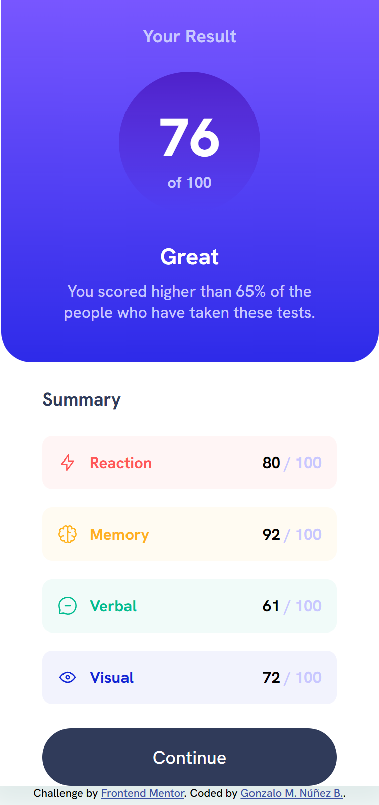
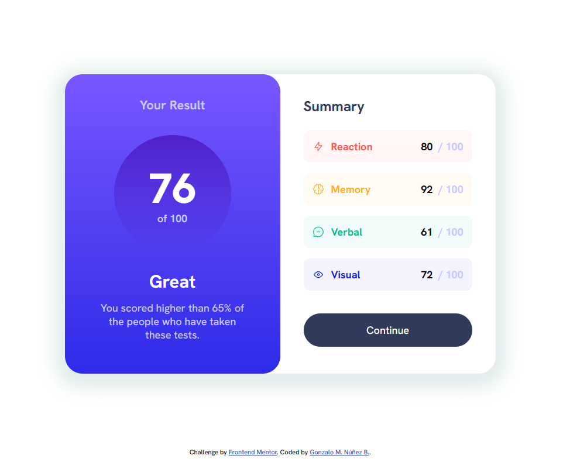

# Frontend Mentor - Results summary component solution

This is a solution to the [Results summary component challenge on Frontend Mentor](https://www.frontendmentor.io/challenges/results-summary-component-CE_K6s0maV). Frontend Mentor challenges help you improve your coding skills by building realistic projects. 

## Table of contents

- [Overview](#overview)
  - [The challenge](#the-challenge)
  - [Screenshots](#screenshot)
  - [Links](#links)
- [My process](#my-process)
  - [Built with](#built-with)
  - [What I learned](#what-i-learned)
  - [Useful resources](#useful-resources)
- [Author](#author)

## Overview

This challenge is a very simple page showing a single card with towo columns showing data inside. A very good exercise for practicing HTML layouts and CSS styling for modile and desktop. A bonus challenge was added for loading a JSON file for data retrival.

### The challenge

Users should be able to:

- View the optimal layout for the interface depending on their device's screen size
- See hover and focus states for all interactive elements on the page
- **Bonus**: Use the local JSON data to dynamically populate the content

### Screenshots

### Links

- Solution URL: [Find solution here](https://github.com/gnunez0101/results-summary)
- Live Site URL: [Find live site here](https://gnunez0101.github.io/results-summary/)

## My process

I began making layout in HTML, then styling with CSS for mobile and desktop versions requested.
After been succesful with pixel perfect appereance I went for the bonus writing a script for loading data from json file. After some thinking I migrated the whole thing to React.JS, since with components this would be really easy. Finally, I tested everything and I sent it.

### Built with

- Semantic HTML5 markup
- CSS custom properties
- Flexbox
- CSS Grid
- Mobile-first workflow
- React JS
- Typescript
- New CSS color-mix command for transparencies

### What I learned

I learned more good practices for dual CSS styling with @media queries for mobile first and then for desktop. This was a good practice for a React JS simple project.

### Useful resources

- [PicPick](https://picpick.app/en/) - Very useful tools for web development tasks, like measuring of pixels on image and a very nice color picker.

## Author

- LinkedIn - [Gonzalo Manuel Núñez](https://www.linkedin.com/in/gnunez0101)
- Frontend Mentor - [@gnunez0101](https://www.frontendmentor.io/profile/gnunez0101)
